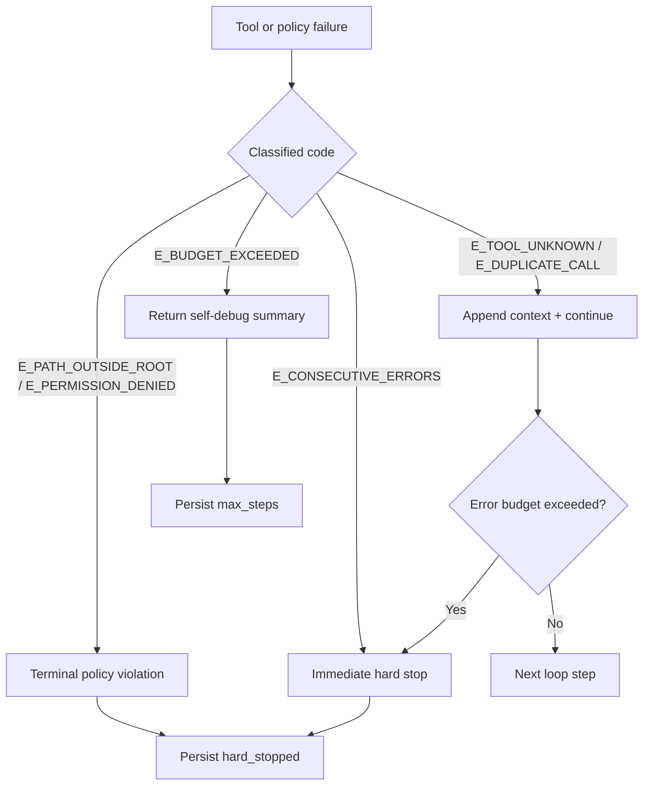
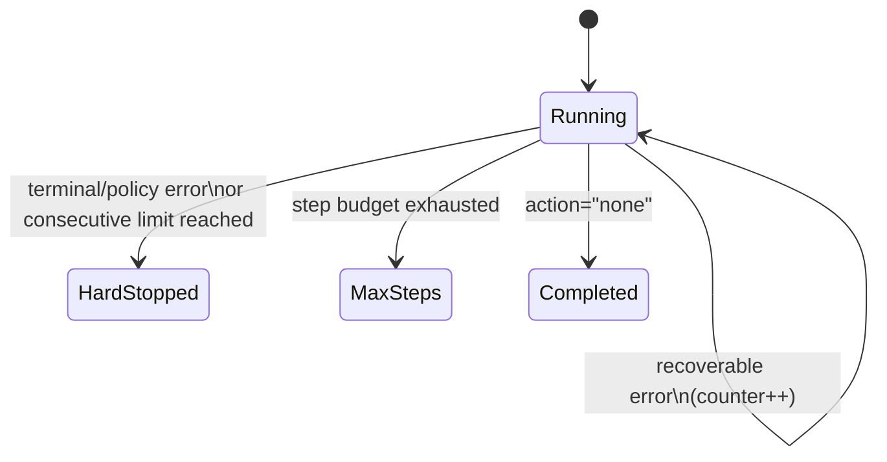

# Error Taxonomy

::: tip TL;DR
Typed error codes let the runtime recover consistently: retry when useful, hard-stop when unsafe, and surface actionable diagnostics.
:::

The agent harness uses typed error codes so it can take precise recovery
actions instead of feeding every raw exception string back to the model.

---

## Error codes

| Code                   | Meaning                                                              | Recovery action                                                                                  |
| ---------------------- | -------------------------------------------------------------------- | ------------------------------------------------------------------------------------------------ |
| `E_PATH_OUTSIDE_ROOT`  | `read_file` / `write_file` path violates sandbox                     | Actionable refusal; increments hard-stop counter (run hard-stops after terminal-error threshold) |
| `E_TOOL_UNKNOWN`       | Model requested a tool not in the registered list                    | Append tool list to context, continue loop                                                       |
| `E_DUPLICATE_CALL`     | Same tool + same input already called this run                       | Skip execution, append dedup notice to context                                                   |
| `E_CONSECUTIVE_ERRORS` | N tool errors in a row (see [Operating Modes](./operating-modes.md)) | **Immediate hard stop** — structured summary returned                                            |
| `E_BUDGET_EXCEEDED`    | Step count over limit                                                | Self-debug summary returned, emits `agent:max_steps`                                             |
| `E_PERMISSION_DENIED`  | Tool requires `allowWrite` but flag is not set                       | Immediate hard stop for that step; increments terminal-error counter                             |

---

## Terminal vs. recoverable errors

**Terminal errors** — never trigger a retry for the same step.  
`E_PATH_OUTSIDE_ROOT` and `E_PERMISSION_DENIED` are definitional: the
operation is structurally impossible, not transiently unavailable.

Each terminal error increments both the consecutive-error counter _and_ a
dedicated `hardStopErrors` counter. Two hard-stop errors in one run trigger
an immediate hard stop regardless of the consecutive-error limit.

**Recoverable errors** — the harness appends context and the model retries.  
`E_TOOL_UNKNOWN`, `E_DUPLICATE_CALL`.

**Budget errors** — the run ends cleanly with a summary.  
`E_CONSECUTIVE_ERRORS`, `E_BUDGET_EXCEEDED`.

---

## Where codes are generated

| Source                                                   | Code                                          |
| -------------------------------------------------------- | --------------------------------------------- |
| `packages/shared/path-safety.ts` — `PathSafetyError`     | `E_PATH_OUTSIDE_ROOT`                         |
| `packages/processors/policy.ts` — `PolicyViolationError` | `E_PERMISSION_DENIED`, `E_CONSECUTIVE_ERRORS` |
| `packages/agent/agent.ts` — unknown-tool handler         | `E_TOOL_UNKNOWN`                              |
| `packages/agent/agent.ts` — deduplicator                 | `E_DUPLICATE_CALL`                            |

---

## How codes surface in diagnostics

Every `IDiagnosticEntry` has an optional `code` field.  
Entries written for classified failures always include the code so the
diagnostic Markdown log shows severity distribution without missing codes:

```json
{
    "timestamp": "2026-05-12T14:00:00.000Z",
    "step": 0,
    "severity": "error",
    "category": "tool",
    "code": "E_PATH_OUTSIDE_ROOT",
    "message": "Tool \"read_file\" failed: Access denied: path is outside the project root"
}
```

---

## Error handling flow





---

See also: [Agent Loop](./agent-loop.md) · [Operating Modes](./operating-modes.md)

Further reading:

- [HTTP status code semantics (RFC 9110)](https://www.rfc-editor.org/rfc/rfc9110)
