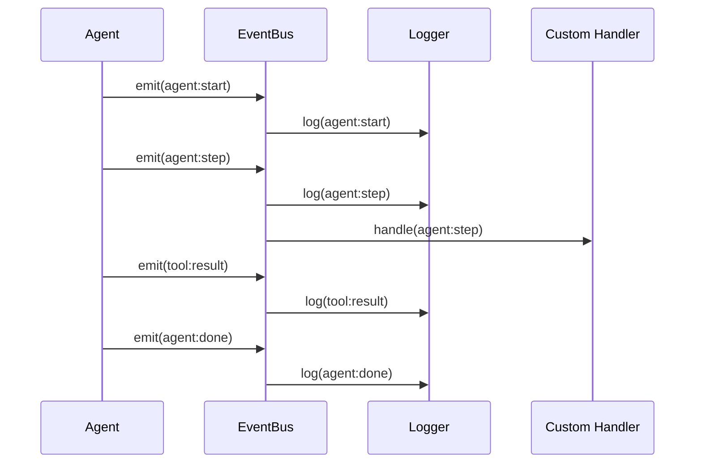

# Theory: Event-Driven Observability

::: tip TL;DR
Components emit named events → API subscribes and logs them. Loose coupling, full observability.
:::

## The one-sentence version

> Instead of logging directly everywhere, components emit named events, and the API subscribes to all of them — making the system observable without coupling logic to logging.

## Visual: Event flow through a typical run

```text
POST /run
  |
  ▼
API  ─────── subscribes to all events via on("*", handler)
  |
  ▼
agent.run(task)
  |
  ├── emit  agent:start      { task }
  |
  ├─[step 1]─────────────────────────────────────
  |   ├── emit  agent:step   { step: 1, thought, action, input }
  |   ├── emit  agent:model_routed  { profile: "code", model: "qwen2.5-coder" }
  |   ├── [tool executes]
  |   └── emit  tool:result  { tool: "read_file", result: "..." }
  |
  ├─[step 2]─────────────────────────────────────
  |   ├── emit  agent:step   { step: 2, thought, action: "none" }
  |   └── (no tool call — action is "none")
  |
  └── emit  agent:done       { answer: "..." }

API logs each event as structured JSON (or pretty-prints if LOG_PRETTY=true)
```

## All event types

| Event | When it fires | Payload |
|---|---|---|
| `agent:start` | Before the first loop step | `{ task }` |
| `agent:step` | After each model decision | `{ step, thought, action, input }` |
| `agent:model_routed` | After router picks a profile | `{ profile, model }` |
| `tool:result` | After a tool runs successfully | `{ tool, result }` |
| `tool:error` | After a tool throws an error | `{ tool, error }` |
| `agent:done` | When action is "none" (task complete) | `{ answer }` |
| `agent:max_steps` | When step limit is reached | `{ steps }` |
| `agent:error` | Unrecoverable loop error | `{ error }` |

## Why it is designed this way

### Without events (tight coupling):
```typescript
// agent.ts
import { logger } from "./logger";

// Now agent depends on logger — harder to test, harder to replace
logger.info("step done", { step, action });
```

### With events (loose coupling):
```typescript
// agent.ts
events.emit({ type: "agent:step", step, action });

// api/index.ts
events.on("*", (event) => logger.info(event));
```

The agent knows nothing about logging. You can swap the logger, add metrics, or send events to a WebSocket — all without touching `agent.ts`.

## How to debug a failed tool call using events

When something goes wrong, follow this sequence:

```
1. Look for  agent:step      → what did the model decide?
2. Look for  tool:error      → what did the tool throw?
3. Look for  agent:step (next) → did the model recover?
4. Look for  agent:max_steps or agent:done → how did it end?
```

Example log output (with `LOG_PRETTY=true`):

```
[agent:start]        task: "Query users table"
[agent:model_routed] profile: "default", model: "llama3.1:8b"
[agent:step]         step: 1, action: "mysql_query", input: { sql: "SELECT * FROM users LIMIT 5" }
[tool:error]         tool: "mysql_query", error: "connect ECONNREFUSED (MYSQL_HOST:3306 — check your MYSQL_HOST env var)"
[agent:step]         step: 2, action: "none", thought: "Database is not reachable, I cannot complete this task."
[agent:done]         answer: "I could not connect to MySQL. Check MYSQL_HOST and MYSQL_PORT."
```

## Current limitations

- **In-memory only**: events exist only while the process is running
- **Process-local only**: no cross-process or distributed event bus
- **Not durable**: restarting the process loses all event history

For production observability, you would replace the in-memory bus with a persistent async infrastructure (e.g. send events to a message queue, write to a log sink, or push to a tracing system).

## Subscribing to events in your own code

```typescript
import { events } from "packages/events";

// Subscribe to all events
events.on("*", (event) => {
  console.log(event.type, event);
});

// Subscribe to specific event
events.on("tool:error", (event) => {
  alertOncall(event.tool, event.error);
});

// Unsubscribe
events.off("tool:error", myHandler);
```


