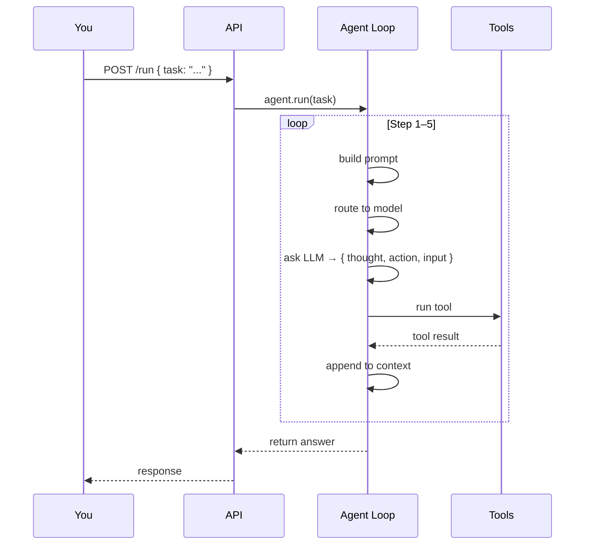
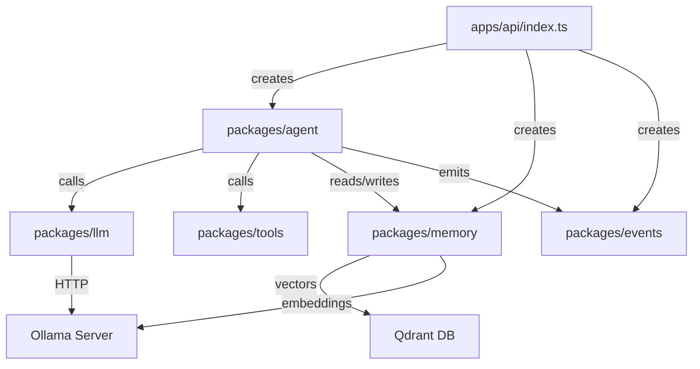

# How It Works (Layered)

::: tip TL;DR
Progressive depth: Layer 1 = 30-second overview, Layer 2 = clickable step map, Layer 3 = what each block does.
:::

This page is designed for **progressive depth** — stop at any layer when you have enough.

- **Layer 1**: broad mental model (30 seconds)
- **Layer 2**: clickable step map (5 minutes)
- **Layer 3**: deeper system details (15 minutes)
- **Ideas & examples**: practical prompts to explore

---

## Layer 1 -- 30-second view

If this is enough to get started, stop here and go run a task.

---

## Layer 2 -- Clickable step map

### Entry point

- **User sends task** -> see [/use-the-application](/use-the-application) for exact curl commands
- **API wires components** -> see [/packages/](/packages/) for what each package does

### Agent loop steps

1. **Build prompt** (task + memory + tool list + context from previous steps)
    - Deep dive: [/theory/prompt-context-memory](/theory/prompt-context-memory)

2. **Route step to a model profile** (fast / reasoning / code / default)
    - Deep dive: [/model-selection](/model-selection)

3. **Ask LLM "what should I do?"** -- returns strict JSON
    - Deep dive: [/packages/llm](/packages/llm)

4. **LLM picks tool + input (or says "none" = done)**
    - Decision contract: [/packages/agent](/packages/agent)

5. **Agent runs that tool** (read_file, shell, mysql_query, etc.)
    - Agent runtime: [/packages/agent](/packages/agent)
    - Tool catalog: [/packages/tools/](/packages/tools/)

6. **Events emit step progress** (agent:step, tool:result, etc.)
    - Event flow: [/theory/events-observability](/theory/events-observability)

7. **Repeat until done or max 5 steps**
    - Loop mental model: [/theory/agent-loop](/theory/agent-loop)

---

## Layer 3 -- What each block is really doing

### API (`apps/api/index.ts`)

- Receives HTTP `POST /run` with a `task` string
- Creates one instance of: Agent + LLM + Memory + Tools + Events per request
- Subscribes to all events for logging
- Returns the final answer string

### Agent (`packages/agent/agent.ts`)

- Runs the bounded loop (max 5 steps)
- Calls LLM, parses JSON, dispatches tools
- Appends tool results to context after each step
- Saves the outcome to memory when done

### LLM (`packages/llm/ollama.ts`)

- Thin HTTP wrapper around Ollama's API
- Sends prompt -> gets back a text response
- Forces JSON output format via Ollama's `format` option

### Model router (`packages/agent/src/model-router.ts`)

- Inspects current task/step and picks the most suitable model profile
- `rules` mode: keyword heuristics
- `model` mode: a small classifier model decides

### Tools (`packages/tools/`)

- Each tool is a `{ name, description, execute(input) }` object
- Deterministic operations: read file, run command, SQL query, etc.
- Safety checks built into each tool's `execute()` function

### Memory (`packages/memory/memory.ts`)

- `addMemory(entry)`: saves outcomes to [Qdrant](/glossary#qdrant) + local [ring buffer](/glossary#ring-buffer)
- `getMemory(query)`: [semantic similarity](/glossary#semantic-search) search to retrieve relevant past results
- Falls back to local-only if Qdrant is unavailable

### Events (`packages/events/bus.ts`)

- In-process pub/sub
- `emit(event)` -> `on(type, handler)` -> handler runs synchronously
- API subscribes with `on("*", ...)` to log everything

---

## Ideas & examples

Try these prompts to explore different layers:

1. **Architecture overview**
    - `Explain the flow from POST /run to final answer in 6 bullet points.`

2. **Prompt building focus**
    - `What information is included in each agent prompt step and why?`

3. **Tool execution focus**
    - `Show me one example where the agent should use read_file before answering.`

4. **Events focus**
    - `Which events should I monitor to debug a failed tool call?`

5. **Boundaries focus**
    - `Give me an example task that should be rejected by tool safety rules.`

6. **Memory focus**
    - `How does semantic memory help the agent on repeated similar tasks?`

---

## ADHD-friendly learning pattern

Pick **one** prompt above. Run it. Check the logs. Write **one** takeaway. Move on.

Do not try to understand everything at once -- use this page as a hub and dive into one deep link per session.
