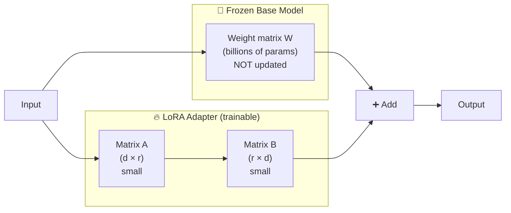
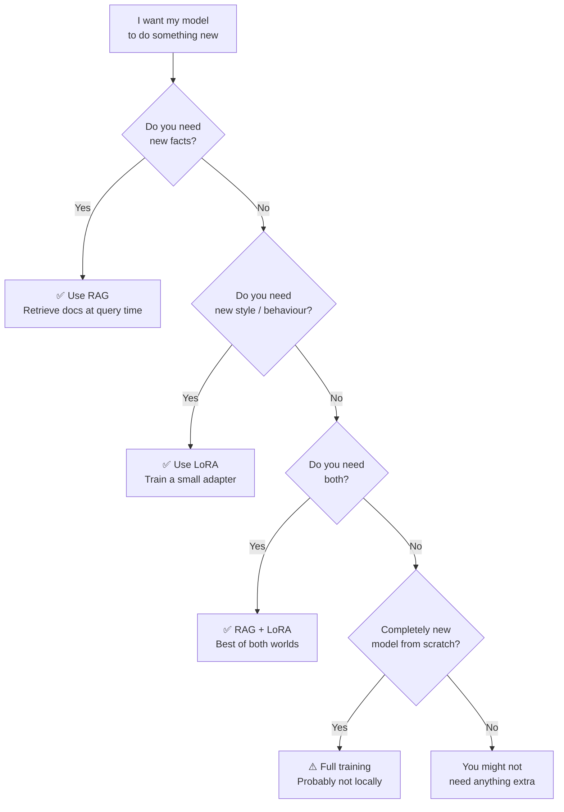

# Theory: LoRA & Fine-Tuning

::: tip TL;DR
**Fine-tuning** = teaching a model new behaviour by retraining it on your data.
**LoRA** = a shortcut that trains only tiny adapter layers instead of the whole model — 90 % cheaper, same idea.
If you just need to give the model **facts**, use [RAG](/theory/RAG) instead.
:::

## What Is Fine-Tuning?

Imagine you hired a **chef** who already knows how to cook. Fine-tuning is like sending that chef on a month-long course to learn a new cuisine — they come back with the knowledge _baked in_.

Compare that to **RAG** (Retrieval-Augmented Generation), which is like handing the same chef a **recipe card** every time they cook. They follow the card without needing to memorize anything.

| Analogy                         | Technique       | When to use                |
| ------------------------------- | --------------- | -------------------------- |
| Send the chef to cooking school | **Fine-tuning** | New _style_ or _behaviour_ |
| Hand the chef a recipe card     | **RAG**         | New _facts_ or _documents_ |

Fine-tuning **changes the model's weights** — the internal numbers that control how it writes. After training, the new behaviour is permanent and doesn't need to be included in every prompt.

---

## Full Fine-Tuning vs LoRA

|                        | Full Fine-Tuning                      | LoRA                                   |
| ---------------------- | ------------------------------------- | -------------------------------------- |
| **What changes**       | Every weight in the model             | Only small adapter layers              |
| **VRAM needed**        | 2–4× model size (e.g. 28 GB for 7B)   | ~model size + ~10 % (e.g. 8 GB for 7B) |
| **Training speed**     | Hours to days                         | Minutes to hours                       |
| **Cost**               | $$$ (multi-GPU)                       | $ (single consumer GPU)                |
| **Risk of forgetting** | High — can overwrite useful knowledge | Low — base model is frozen             |
| **Best for**           | Building a fundamentally new model    | Adapting style, tone, format, domain   |

**Bottom line:** unless you're a research lab, LoRA is almost always the right choice for local fine-tuning.

---

## How LoRA Works

### The Intuition

A large model has **billions** of weights arranged in big matrices. Full fine-tuning updates every one of them. LoRA's insight: _the useful changes during fine-tuning actually live in a much smaller space_.

LoRA freezes the entire base model and injects **two small matrices** (A and B) next to each layer. During training, only A and B are updated. At inference time, their product is added to the original weight — like a small correction patch on top of the base model.



### Key Parameters

| Parameter          | What it controls                                                                   | Typical values                           |
| ------------------ | ---------------------------------------------------------------------------------- | ---------------------------------------- |
| **Rank (r)**       | Size of matrices A and B. Higher = more expressive but more VRAM.                  | 8–64                                     |
| **Alpha (α)**      | Scaling factor for the adapter's contribution. Usually set to `α = r` or `α = 2r`. | 16–128                                   |
| **Target modules** | Which layers get adapters (attention layers are standard).                         | `q_proj`, `v_proj`, sometimes all linear |

Think of **rank** like resolution: rank 8 is a rough sketch of the behaviour change, rank 64 is a detailed portrait. Most tasks work fine at rank 16–32.

---

## When to Use What



---

## LoRA in Practice (Ollama)

Ollama supports loading LoRA adapters via a **Modelfile**:

```dockerfile
FROM llama3
ADAPTER ./my-lora-adapter.gguf
```

The workflow:

1. Fine-tune with a tool like [**Unsloth**](https://github.com/unslothai/unsloth) or [**Axolotl**](https://github.com/axolotl-ai-cloud/axolotl).
2. Export the adapter (`.safetensors` or convert to `.gguf`).
3. Reference it in a Modelfile and run `ollama create`.

::: tip
See the [Modelfile Example](/infra/modelfile-example) page for full syntax reference.
:::

::: warning
Ollama currently expects adapters in **GGUF format**. If your training tool exports `.safetensors`, you'll need to convert — see the [practical guide](/theory/lora-practical#step-4-export-and-convert).
:::

**Ollama docs:** [https://github.com/ollama/ollama/blob/main/docs/modelfile.md](https://github.com/ollama/ollama/blob/main/docs/modelfile.md)

---

## What You Need (Hardware)

Minimum hardware for **LoRA fine-tuning** (not inference — just training):

| Model size | VRAM (LoRA, QLoRA) | RAM    | Notes                              |
| ---------- | ------------------ | ------ | ---------------------------------- |
| **3B**     | 6 GB               | 16 GB  | Works on most modern GPUs          |
| **7B**     | 8–10 GB            | 16 GB  | RTX 3060 12 GB / RTX 4060 Ti 16 GB |
| **13B**    | 12–16 GB           | 32 GB  | RTX 4070 Ti Super / RTX 4090       |
| **34B**    | 24–40 GB           | 64 GB  | RTX 4090 or A100                   |
| **70B**    | 48+ GB             | 128 GB | Multi-GPU or cloud (A100 ×2)       |

::: tip QLoRA = quantized LoRA
**QLoRA** loads the base model in 4-bit quantization during training, cutting VRAM roughly in half. This is how you fine-tune a 7B model on an 8 GB GPU.
:::

---

## Glossary Links

- [LoRA](/glossary#lora) — Low-Rank Adaptation
- [Fine-Tuning](/glossary#fine-tuning) — Retraining on custom data
- [Weights](/glossary#weights) — The learned numbers inside a model
- [Quantization](/glossary#quantization) — Compressing model weights
- [RAG](/glossary#rag) — Retrieval-Augmented Generation
- [VRAM](/glossary#vram) — GPU memory
