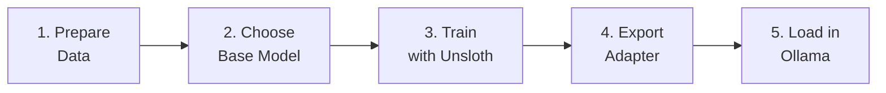

# Practical: LoRA Fine-Tuning Step by Step

::: tip TL;DR
Prepare data → pick a base model → train with Unsloth → export adapter → load in Ollama. That's it.
:::

## Overview



| Step | Time | Difficulty |
| --- | --- | --- |
| 1. Prepare data | 1–8 hours (manual curation) | Medium |
| 2. Choose base model | 5 minutes | Easy |
| 3. Train | 15 min – 4 hours (depends on GPU + dataset) | Easy (with Unsloth) |
| 4. Export & convert | 5–15 minutes | Easy |
| 5. Load in Ollama | 2 minutes | Easy |

---

## Step 1: Prepare Your Data

LoRA training expects a dataset of **instruction / input / output** examples in JSONL format — one JSON object per line.

### Format

```jsonl
{"instruction": "Refactor this function to use early returns", "input": "function check(x) { if (x > 0) { return true; } else { return false; } }", "output": "function check(x) {\n  if (x <= 0) return false;\n  return true;\n}"}
{"instruction": "Add JSDoc to this function", "input": "function add(a, b) { return a + b; }", "output": "/**\n * Adds two numbers.\n * @param a - First number\n * @param b - Second number\n * @returns The sum of a and b\n */\nfunction add(a: number, b: number): number {\n  return a + b;\n}"}
```

### How Many Examples?

| Dataset size | Expected result |
| --- | --- |
| < 50 | Too small — model won't learn much |
| 50–500 | Good for narrow style/format changes |
| 500–5,000 | Solid for domain-specific behaviour |
| 5,000–50,000 | Excellent, diminishing returns above this |

::: warning Quality over quantity
100 **perfect** examples beat 10,000 sloppy ones. Garbage in, garbage out — curate your data carefully.
:::

### Tips

- Keep instructions **consistent** — use the same phrasing style across examples.
- Include **edge cases** — the model learns from variety.
- For code tasks, include examples of different languages/patterns you care about.

---

## Step 2: Choose a Base Model

Pick a base model that already does well at your target task — LoRA _adjusts_ behaviour, it doesn't teach from scratch.

| Task | Recommended base models | Why |
| --- | --- | --- |
| **Code generation** | `Qwen2.5-Coder`, `CodeLlama` | Pre-trained on code, strong baseline |
| **General assistant** | `Llama3`, `Mistral` | Well-rounded, widely supported |
| **Multilingual** | `Qwen2.5`, `Aya` | Strong non-English performance |
| **Long context** | `Qwen2.5` (32K–128K), `Llama3` (128K) | Native long-context support |
| **Small/edge** | `Phi-3-mini`, `Gemma-2B` | Runs on minimal hardware |

::: tip Match the size to your hardware
Check the [hardware requirements table](/theory/lora-fine-tuning#what-you-need-hardware) before picking. A 7B model is the sweet spot for most consumer GPUs.
:::

---

## Step 3: Train with Unsloth

[**Unsloth**](https://github.com/unslothai/unsloth) is the fastest and easiest way to LoRA fine-tune locally. It's a Python library that wraps Hugging Face Transformers with 2× speed optimizations.

### Key Lines

```python
from unsloth import FastLanguageModel

# 1. Load base model in 4-bit (QLoRA)
model, tokenizer = FastLanguageModel.from_pretrained(
    model_name="unsloth/Qwen2.5-Coder-7B-Instruct-bnb-4bit",
    max_seq_length=2048,
    load_in_4bit=True,
)

# 2. Attach LoRA adapters
model = FastLanguageModel.get_peft_model(
    model,
    r=16,               # rank — 16 is a good default
    lora_alpha=32,       # scaling — usually 2× rank
    lora_dropout=0.05,
    target_modules=["q_proj", "k_proj", "v_proj", "o_proj",
                     "gate_proj", "up_proj", "down_proj"],
)

# 3. Train
from trl import SFTTrainer
from transformers import TrainingArguments

trainer = SFTTrainer(
    model=model,
    tokenizer=tokenizer,
    train_dataset=dataset,            # your JSONL loaded as HF Dataset
    args=TrainingArguments(
        output_dir="./output",
        per_device_train_batch_size=4,
        num_train_epochs=3,
        learning_rate=2e-4,
        fp16=True,
    ),
)
trainer.train()
```

::: tip Typical training times
- **500 examples, 7B model, RTX 4060 Ti:** ~15–30 minutes
- **5,000 examples, 7B model, RTX 4090:** ~1–2 hours

Unsloth is roughly 2× faster than vanilla Hugging Face.
:::

**Alternative:** [**Axolotl**](https://github.com/axolotl-ai-cloud/axolotl) — YAML-config-driven, more options, steeper learning curve. Great for reproducible experiments.

**Full Unsloth docs:** [https://docs.unsloth.ai](https://docs.unsloth.ai)

---

## Step 4: Export and Convert

After training, you'll have two files in your output directory:

```
output/
├── adapter_model.safetensors    # the LoRA weights
└── adapter_config.json          # rank, alpha, target modules
```

### Convert to GGUF (Required for Ollama)

Ollama needs adapters in **GGUF format**. Use Unsloth's built-in export:

```python
# Save as GGUF directly (recommended)
model.save_pretrained_gguf(
    "output-gguf",
    tokenizer,
    quantization_method="q4_k_m",   # or "f16" for full precision
)
```

Or convert manually with `llama.cpp`:

```bash
python llama.cpp/convert_lora_to_gguf.py \
  --base models/Qwen2.5-Coder-7B \
  --lora output/ \
  --outfile my-adapter.gguf
```

::: warning
The base model used during conversion must match the one used during training — same architecture, same size.
:::

---

## Step 5: Load in Ollama

Create a `Modelfile`:

```dockerfile
FROM qwen2.5-coder:7b
ADAPTER ./my-adapter.gguf

PARAMETER temperature 0.7
SYSTEM "You are a code assistant that follows project conventions."
```

Build and run:

```bash
# Create the custom model
ollama create my-finetuned-model -f Modelfile

# Test it
ollama run my-finetuned-model "Refactor this function to use early returns"
```

That's it — your LoRA adapter is now loaded in Ollama and ready to use with Manna or any Ollama-compatible tool.

::: tip Point Manna at it
Set `OLLAMA_MODEL=my-finetuned-model` in your `.env` to use it as the default model, or configure it as a model profile.
:::

---

## When NOT to Fine-Tune

Before investing time in LoRA training, check if a simpler approach works:

| Situation | Better alternative |
| --- | --- |
| You need the model to know **specific facts** (docs, APIs, data) | Use [RAG](/theory/RAG) — retrieve docs at query time |
| You need **real-time data** (stock prices, weather, live APIs) | Use [tools](/packages/tools/) — call APIs directly |
| Your dataset has **< 50 examples** | Too small for LoRA — use few-shot prompting instead |
| You want a **different output format** (JSON, XML, etc.) | Try system prompt engineering first |
| The base model is **already good** at the task | Don't fix what isn't broken — test first |

::: tip The golden rule
Try prompting first, then RAG, then LoRA. Fine-tuning is the **last** lever to pull, not the first.
:::

---

## Related Pages

- [LoRA & Fine-Tuning Theory](/theory/lora-fine-tuning) — How LoRA works, when to use it, hardware requirements
- [RAG Theory](/theory/RAG) — Retrieval-Augmented Generation explained
- [Modelfile Example](/infra/modelfile-example) — Full Ollama Modelfile reference
- [Glossary](/glossary) — Quick definitions of all technical terms
