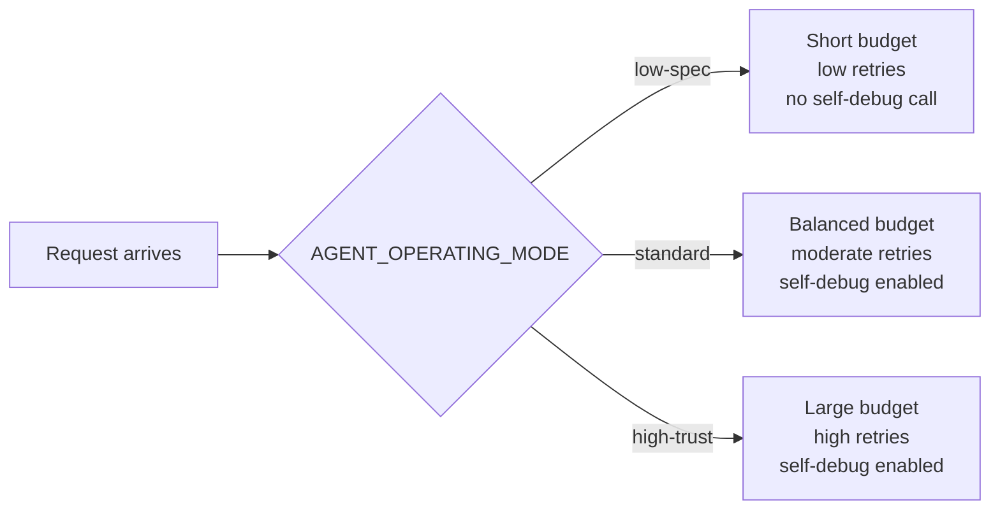
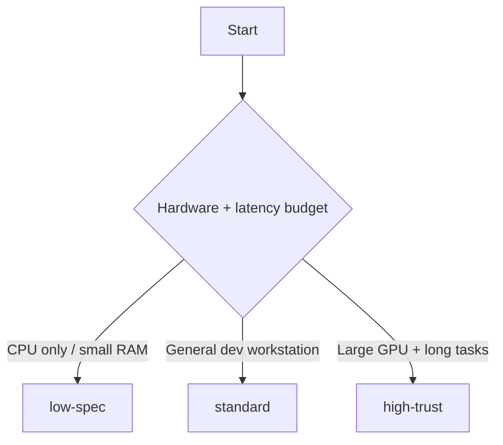

# Operating Modes

::: tip TL;DR
Choose `low-spec`, `standard`, or `high-trust` to set step budget, retry tolerance, and self-debug behavior for your hardware profile.
:::

Manna supports three explicit operating modes that scale step budgets, error
tolerances, and self-debug behaviour to match your hardware and trust level.

Set the mode via the `AGENT_OPERATING_MODE` environment variable.
The default is `standard`.

---

## Mode comparison

| Setting                                 | `low-spec`                        | `standard` (default)                      | `high-trust`                     |
| --------------------------------------- | --------------------------------- | ----------------------------------------- | -------------------------------- |
| `AGENT_OPERATING_MODE`                  | `low-spec`                        | `standard`                                | `high-trust`                     |
| `AGENTS_MAX_STEPS` default              | 5                                 | 20                                        | 50                               |
| `AGENT_MAX_TOOL_CALLS` default          | 3                                 | 10                                        | 20                               |
| `AGENT_CONSECUTIVE_ERROR_LIMIT` default | 2                                 | 3                                         | 5                                |
| Self-debug on exhaustion                | No (returns fallback)             | Yes (fast model)                          | Yes (fast model)                 |
| Target hardware                         | 8–16 GB RAM, CPU-only, ≤8B models | 16–32 GB RAM, mid-range GPU, 7–13B models | 32+ GB VRAM, large models (34B+) |



---

## Individual env-var overrides

Each limit can be overridden independently without changing the mode:

```bash
# Use standard mode but allow 30 steps
AGENT_OPERATING_MODE=standard
AGENTS_MAX_STEPS=30

# Use low-spec mode but allow 3 consecutive errors instead of 2
AGENT_OPERATING_MODE=low-spec
AGENT_CONSECUTIVE_ERROR_LIMIT=3
```

Individual env vars **win over** mode defaults when set to a positive integer.

---

## How the mode is resolved

At startup, `resolveOperatingModeConfig()` in `packages/shared/operating-mode.ts`:

1. Reads `AGENT_OPERATING_MODE` (default: `"standard"`, case-insensitive).
2. Looks up the mode-specific defaults from the built-in table.
3. Applies any individual env-var overrides.
4. Returns an `IOperatingModeConfig` object used by `Agent.run()`.

## Which mode should I pick?



---

## Self-debug on step exhaustion

When the agent exhausts its step budget without completing the task:

- **`low-spec`** — skips the self-debug LLM call entirely and returns a
  generic fallback string. Saves tokens on hardware where every call matters.
- **`standard`** — runs a self-debug prompt using the `fast` model profile to
  summarise what was tried and suggest next steps.
- **`high-trust`** — same as standard (currently uses the `fast` model;
  switching to `reasoning` is a planned upgrade).

---

See also: [Error Taxonomy](./error-taxonomy.md) · [Agent Loop](./agent-loop.md)

Further reading:

- [Ollama docs](https://github.com/ollama/ollama/tree/main/docs)
