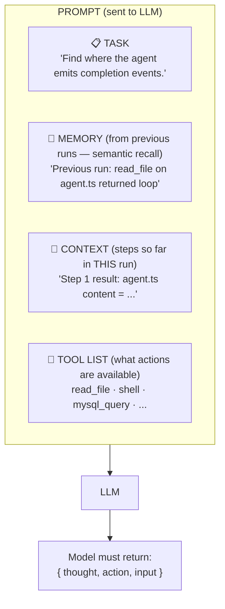
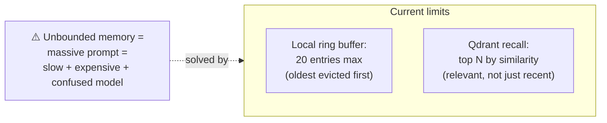
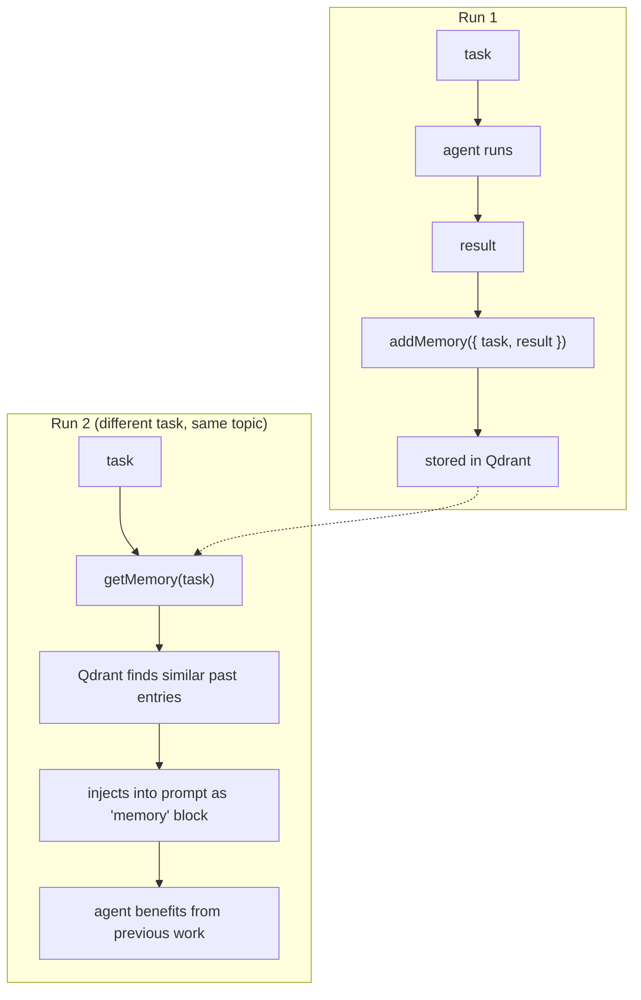
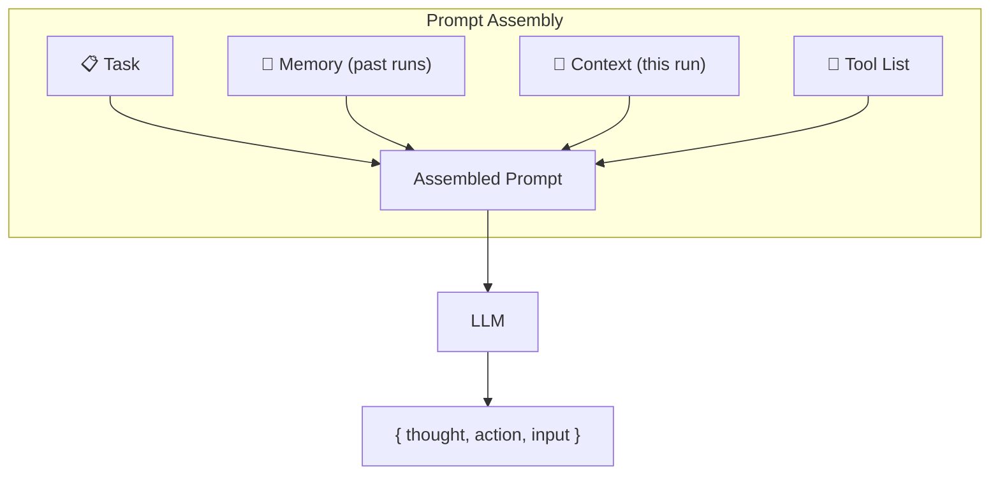

# Theory: Prompt, Context, and Memory

::: tip TL;DR
Each LLM call sees: task + memory (past runs) + context (current run) + tool list → returns JSON decision.
:::

## The one-sentence version

> Every time the model is asked "what should I do?", it sees a prompt assembled from four blocks — and the quality of that prompt determines the quality of the decision.

## Visual: What the model sees each step



## Each block explained

### Task

What the user wants right now. Provided once at the start, included in every step's prompt.

```
"Read package.json and tell me all npm scripts."
```

### Memory

Relevant outcomes from **previous runs** (not the current one). Retrieved by semantic similarity to the current task.

```
Memory entry: "task=read npm scripts, result=found 6 scripts: dev, build, ..."
```

This lets the agent "remember" that it did something similar before, even across sessions.

### Context

The **growing log** of what happened in the current run. Each tool result is appended here.

```
Step 1 result: [package.json content]
Step 2 result: [agent answer]
```

Context is local to one run — it resets when a new `/run` request comes in.

### Tool list

The list of currently available tools with their descriptions. This is what the model reads to decide which tool to call.

```
read_file: "Read UTF-8 file content from disk. Input: { path }"
shell: "Run an allowlisted shell command. Input: { command }"
...
```

## Why memory is capped



Capped memory keeps prompts focused and the model sharp.

## The strict JSON contract

The model is forced to return **exactly this structure**:

```json
{
    "thought": "I need to read package.json to find the scripts.",
    "action": "read_file",
    "input": { "path": "package.json" }
}
```

```json
{
    "thought": "I have all the information I need to answer.",
    "action": "none",
    "input": {}
}
```

### Why strict JSON?

- **No ambiguity**: the runtime parses the JSON deterministically
- **Reliable tool dispatch**: `action` maps directly to a registered tool name
- **No hallucinated prose**: the model cannot ramble instead of deciding
- **Easy error handling**: if JSON is invalid, the runtime adds a correction to context

## Real-life example: multi-step context building

```
Task: "Find where the agent emits completion events and summarise them."

STEP 1 PROMPT:
  task: "Find where agent emits completion events..."
  memory: (empty for first run)
  context: (empty)
  tools: [read_file, shell, ...]

  → LLM: { thought: "Check agent.ts", action: "read_file", input: { path: "packages/agent/agent.ts" } }

STEP 2 PROMPT:
  task: "Find where agent emits completion events..."
  memory: (empty)
  context: "Step 1: [full content of agent.ts]"
  tools: [read_file, shell, ...]

  → LLM: { thought: "I can see the emit calls, I can answer now", action: "none", input: {} }
  → Final answer: "The agent emits agent:done in agent.ts line 87, and agent:max_steps on line 94."
```

## Memory lifecycle (across runs)




