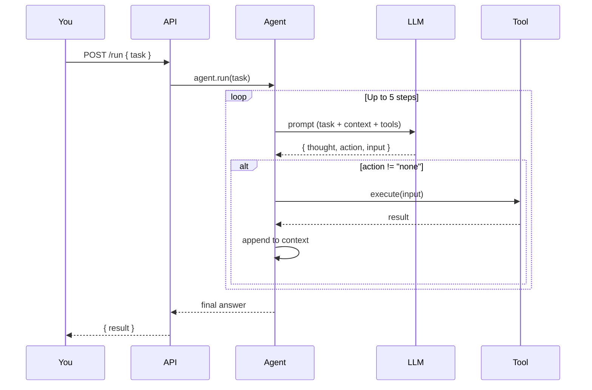

# Use the Application

::: tip TL;DR
Install → start Ollama → start Qdrant → start API → POST /run with a task → get an answer.
:::

This is the shortest path from zero to first successful agent run.

## 1) Install dependencies

```bash
npm install
```

## 2) Start Ollama + Open WebUI stack

```bash
cd infra/podman
cp .env.example .env
# set LINUX_USERNAME and WEBUI_SECRET_KEY
docker compose --env-file .env up -d
```

- Open WebUI: `http://localhost:3000`
- Ollama API: `http://localhost:11434`

## 2.5) Start Qdrant (semantic memory)

```bash
docker run -d \
  --name qdrant \
  -p 6333:6333 \
  -v $(pwd)/data/qdrant:/qdrant/storage \
  qdrant/qdrant
```

## 3) Start the API

```bash
cd /path/to/AI-coding-assistant
npm run dev
```

Default API URL: `http://localhost:3001`

## 3.5) Use dedicated IDE endpoints (separate from `/run`)

These endpoints are independent and can be wired to different WebStorm UX surfaces:

- `POST /autocomplete` for inline suggestions at cursor position
- `POST /lint-conventions` for lint + conventions findings
- `POST /page-review` for whole-file/page categorized review

```bash
curl -X POST http://localhost:3001/autocomplete \
  -H "Content-Type: application/json" \
  -d '{"prefix":"const answer = ","language":"typescript"}'
```

```bash
curl -X POST http://localhost:3001/lint-conventions \
  -H "Content-Type: application/json" \
  -d '{"content":"var x = 1\\nconsole.log(x)","language":"javascript"}'
```

```bash
curl -X POST http://localhost:3001/page-review \
  -H "Content-Type: application/json" \
  -d '{"content":"export function add(a:number,b:number){return a+b}","language":"typescript"}'
```

## 4) Run your first task

```bash
curl -X POST http://localhost:3001/run \
  -H "Content-Type: application/json" \
  -d '{"task":"List files in the current directory"}'
```

## 5) What should happen

- API receives `task`
- Agent builds prompt + context + memory + tool list
- LLM returns JSON with `thought`, `action`, `input`
- Tool executes (if `action` is not `none`)
- Loop repeats until done or max 5 steps

### Agent loop visualized



## 6) Browser tool is enabled by default

`browser_fetch` is already wired in `apps/api/index.ts`.
Chromium is installed automatically on `npm install` via the project `postinstall` script.

## 7) Enable write mode only when needed

Write tools are disabled by default and only exposed when request body sets `allowWrite: true`.

```bash
curl -X POST http://localhost:3001/run \
  -H "Content-Type: application/json" \
  -d '{"task":"Scaffold project my-react-app from template react-ts and create README notes","allowWrite":true}'
```

Write mode tools:

- `scaffold_project`
- `write_file`

Optional env vars:

- `BOILERPLATE_ROOT` (default `data/boilerplates`)
- `PROJECT_OUTPUT_ROOT` (default `data/generated-projects`)

## 8) Common troubleshooting

- Ollama not reachable: check `OLLAMA_BASE_URL` (default `http://localhost:11434`)
- Router selects wrong profile: tune `AGENT_MODEL_ROUTER_MODE` and `AGENT_MODEL_*` env vars
- Qdrant not reachable: check `QDRANT_URL` (default `http://localhost:6333`)
- Empty/invalid request: ensure body includes non-empty `"task"`
- MySQL tool fails: verify `MYSQL_*` env vars and DB availability

## 9) Learn-by-doing next

Go to [/scenarios](/scenarios) and run the exercises one by one.

If you are deciding which Ollama model to run (fast vs heavy, coding vs reasoning, local limits), see [/model-selection](/model-selection).

## 10) Start from your own boilerplates (write mode roadmap)

Current setup is mostly read-oriented. To generate projects from your own templates, start with this sequence:

1. Add your boilerplates under a fixed root (for example `data/boilerplates/`).
2. Add a small metadata file per template (stack, language, package manager, test command).
3. Keep your coding standards in docs (naming, architecture, folder style, quality rules).
4. Add a write-capable tool (create/update files) with strict path boundaries.
5. Add a scaffold tool (copy chosen boilerplate into a new target folder).
6. Keep shell allowlist strict and only add commands required for safe project setup.
7. Run generation tasks with explicit prompts (template, target path, constraints, required checks).

This gives you controlled writing only when requested, while keeping the default behavior safe.
