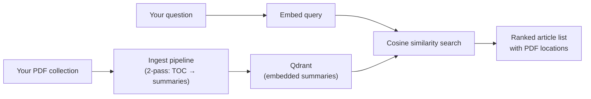
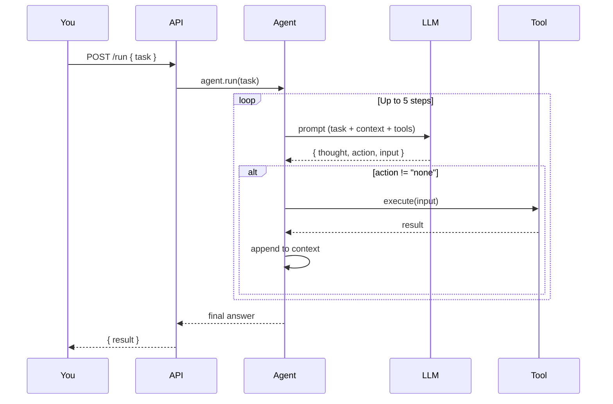

# Use the Application

::: tip TL;DR
Manna is versatile — you can use it as an AI agent inside your IDE, as an agentic coding engine to build entire websites, or as a searchable knowledge base over your own PDFs and documents.
:::

There are several ways to use Manna, each suited to a different workflow. This page covers the initial setup and then explains each use case individually.

---

## Quick Setup (required for all use cases)

Before using Manna in any mode, you need the base stack running.

### 1. Install dependencies

```bash
npm install
```

### 2. Start Ollama

```bash
cp .env.example .env
# set LINUX_USERNAME
docker compose --env-file .env up -d
```

- Ollama API: `http://localhost:11434`

### 3. Start Qdrant (semantic memory)

```bash
docker run -d \
  --name qdrant \
  -p 6333:6333 \
  -v $(pwd)/data/qdrant:/qdrant/storage \
  qdrant/qdrant
```

If Qdrant is unavailable, Manna continues with local in-memory recent memory only — but semantic recall is lost.

### 4. Start the Manna API

```bash
npm run dev
```

Default API URL: `http://localhost:3001`

### Verify it works

```bash
curl -X POST http://localhost:3001/run \
  -H "Content-Type: application/json" \
  -d '{"task":"List files in the current directory"}'
```

You should get back a JSON response with the agent's answer. If this works, the stack is healthy and you can proceed to any of the use cases below.

---

## Use Case 1: IDE Agent (WebStorm, VS Code, etc.)

Manna exposes dedicated HTTP endpoints designed for IDE integration. These endpoints bypass the full agentic loop and are optimised for low-latency responses at cursor-time.

### Available IDE endpoints

| Endpoint                 | Purpose                                       | Typical latency |
| ------------------------ | --------------------------------------------- | --------------- |
| `POST /autocomplete`     | Inline code completion at cursor              | < 200 ms        |
| `POST /lint-conventions` | Lint findings + convention checks             | < 500 ms        |
| `POST /page-review`      | Full-file review with categorised suggestions | 1–3 s           |

### WebStorm setup

WebStorm supports external HTTP-based tools through its **HTTP Client** and **External Tools** features. Here is how to wire each endpoint:

#### Autocomplete suggestions

1. Open **Settings → Tools → External Tools → Add**.
2. Set **Program** to `curl` and **Arguments** to:
    ```
    -s -X POST http://localhost:3001/autocomplete -H "Content-Type: application/json" -d "{\"prefix\":\"$SelectedText$\",\"language\":\"$FileExt$\"}"
    ```
3. Assign a keyboard shortcut (e.g. `Ctrl+Alt+A`).
4. When triggered, the selected text (or text before cursor) is sent as the prefix, and the model returns a completion suggestion.

#### Lint and convention checks

1. Add another external tool with:
    ```
    -s -X POST http://localhost:3001/lint-conventions -H "Content-Type: application/json" -d "{\"content\":\"$SelectedText$\",\"language\":\"$FileExt$\"}"
    ```
2. This returns deterministic findings (TypeScript checks, convention rules) followed by optional LLM-enriched suggestions.

#### Full page review

1. Add another external tool with:
    ```
    -s -X POST http://localhost:3001/page-review -H "Content-Type: application/json" -d "{\"content\":\"$SelectedText$\",\"language\":\"$FileExt$\"}"
    ```
2. This analyses the entire file and returns categorised suggestions (readability, performance, bugs, style).

### VS Code setup

For VS Code, you can use the **REST Client** extension or create a task in `.vscode/tasks.json`:

```json
{
    "version": "2.0.0",
    "tasks": [
        {
            "label": "Manna: Autocomplete",
            "type": "shell",
            "command": "curl -s -X POST http://localhost:3001/autocomplete -H 'Content-Type: application/json' -d '{\"prefix\":\"${selectedText}\",\"language\":\"${fileExtname}\"}'",
            "presentation": { "reveal": "always", "panel": "dedicated" }
        },
        {
            "label": "Manna: Page Review",
            "type": "shell",
            "command": "curl -s -X POST http://localhost:3001/page-review -H 'Content-Type: application/json' -d '{\"content\":\"${selectedText}\",\"language\":\"${fileExtname}\"}'",
            "presentation": { "reveal": "always", "panel": "dedicated" }
        }
    ]
}
```

Bind these tasks to keyboard shortcuts via **Preferences → Keyboard Shortcuts**.

### Other IDEs

Any IDE that supports external tools or HTTP requests can integrate with Manna. The pattern is always the same:

1. Send a POST request to the relevant endpoint.
2. Pass the code content (or selection) and the language identifier.
3. Display the JSON response in a panel or tooltip.

### Example requests

```bash
# Autocomplete
curl -X POST http://localhost:3001/autocomplete \
  -H "Content-Type: application/json" \
  -d '{"prefix":"const answer = ","language":"typescript"}'

# Lint + conventions
curl -X POST http://localhost:3001/lint-conventions \
  -H "Content-Type: application/json" \
  -d '{"content":"var x = 1\nconsole.log(x)","language":"javascript"}'

# Full page review
curl -X POST http://localhost:3001/page-review \
  -H "Content-Type: application/json" \
  -d '{"content":"export function add(a:number,b:number){return a+b}","language":"typescript"}'
```

---

## Use Case 2: Agentic Programming (Build Websites and Projects)

This is the most powerful use of Manna. By enabling write mode, the agent can scaffold projects, create files, run shell commands, and iteratively build working code — all driven by natural language instructions.

### How it works

When you send a request with `"allowWrite": true`, the agent gains access to:

- **`scaffold_project`** — copies a boilerplate template into a new project folder
- **`write_file`** — creates or overwrites files inside the project output directory

Combined with the always-available read tools (`read_file`, `shell`, `browser_fetch`), the agent can:

1. Scaffold a project from a template
2. Read existing files to understand the structure
3. Write new files or modify existing ones
4. Run shell commands to install dependencies, build, or test
5. Iterate based on errors or requirements

### Starting from scratch

Send a task describing what you want. The agent will use its tools to build it step by step:

```bash
curl -X POST http://localhost:3001/run \
  -H "Content-Type: application/json" \
  -d '{
    "task": "Create a simple landing page with HTML, CSS, and JavaScript. Include a hero section, a features grid, and a contact form.",
    "allowWrite": true
  }'
```

The agent will create files under `data/generated-projects/` (configurable via `PROJECT_OUTPUT_ROOT`).

### Starting from a boilerplate

If you have boilerplate templates, place them under `data/boilerplates/` (configurable via `BOILERPLATE_ROOT`). Each template is a folder containing a ready-to-use project structure.

```
data/boilerplates/
├── react-ts/          ← React + TypeScript starter
├── vue-landing/       ← Vue.js landing page
├── express-api/       ← Express REST API
└── static-site/       ← Plain HTML/CSS/JS
```

Then ask the agent to scaffold from a specific template:

```bash
curl -X POST http://localhost:3001/run \
  -H "Content-Type: application/json" \
  -d '{
    "task": "Scaffold a new project from template react-ts called my-portfolio, then add a dark mode toggle component",
    "allowWrite": true
  }'
```

The agent will:

1. Copy the `react-ts` boilerplate into `data/generated-projects/my-portfolio/`
2. Read the existing structure to understand the code
3. Create the dark mode toggle component
4. Wire it into the app

### Teaching the agent your custom libraries

If you use private or custom libraries that the agent does not know about, you can teach it by providing documentation as context. There are several strategies:

#### Strategy 1: Include library docs in the project

Place a `LIBRARY_DOCS.md` or `AI_CONTEXT.md` file in your boilerplate that describes your library's API, components, and conventions. When the agent reads the project files, it will pick up this context automatically.

```markdown
<!-- data/boilerplates/my-stack/AI_CONTEXT.md -->

# Custom Library Reference

## @my-org/ui-kit

- `<Button variant="primary|ghost|danger">` — Standard button component
- `<Card elevation={1|2|3}>` — Card container with shadow levels
- `<FormField label="..." error="...">` — Form field wrapper with validation display

## @my-org/api-client

- `createClient({ baseUrl, token })` — Initialize API client
- `client.get<T>(path)` — Type-safe GET request
- `client.post<T>(path, body)` — Type-safe POST request

## Conventions

- All components use CSS Modules (`.module.css`)
- State management via Zustand stores in `src/stores/`
- API calls only in `src/api/` directory
```

#### Strategy 2: Feed documentation in the task prompt

For one-off tasks, include relevant information directly in the prompt:

```bash
curl -X POST http://localhost:3001/run \
  -H "Content-Type: application/json" \
  -d '{
    "task": "Create a user profile page using my UI kit. The UI kit exports: <Card>, <Avatar>, <Button variant=primary|ghost>, <Badge>. All components accept a className prop. Use CSS Modules for styling.",
    "allowWrite": true
  }'
```

#### Strategy 3: Use semantic memory

If you have already run tasks that used your custom libraries, Manna's semantic memory (via Qdrant) will recall past context about those libraries in future tasks. Over time, the agent builds up knowledge about your tools and conventions through repeated use.

#### Strategy 4: Ingest library documentation as a knowledge base

For comprehensive coverage, ingest your library's documentation PDFs or markdown files into a Qdrant collection using the [Library Ingestion](/library-ingestion) pipeline. The agent can then use `semantic_search` to look up relevant API details during code generation.

### Tips for effective agentic programming

- **Be specific about tech stack**: "React with TypeScript and Tailwind CSS" is better than "a web page".
- **Mention file structure preferences**: "Put components in `src/components/` and pages in `src/pages/`".
- **Reference your conventions**: "Follow the coding style in AI_CONTEXT.md".
- **Use multi-step prompts for complex projects**: scaffold first, then add features one at a time.
- **Review generated code**: the agent is powerful but not infallible — always review what it produces.

### Environment variables

| Variable              | Default                   | Description                           |
| --------------------- | ------------------------- | ------------------------------------- |
| `BOILERPLATE_ROOT`    | `data/boilerplates`       | Where your boilerplate templates live |
| `PROJECT_OUTPUT_ROOT` | `data/generated-projects` | Where generated projects are written  |

---

## Use Case 3: Knowledge Base — Talk to Your PDFs and Documents

Manna can act as a **semantic search engine** over your own document collections. Instead of manually searching through hundreds of PDFs, you ingest them once and then ask natural language questions to find the most relevant articles or sections.

### How it works

The system uses a **summary-index approach** (not full RAG):

1. **Ingest**: PDFs are processed in two passes — first the table of contents is extracted, then each article is summarised and embedded.
2. **Store**: One embedding per article is stored in Qdrant, along with metadata (title, summary, topics, page numbers, PDF path).
3. **Search**: When you ask a question, it is embedded and matched against the article summaries using cosine similarity.
4. **Result**: You get a ranked list of articles with exact citations (title, page range, PDF path) — you read the original source, the AI just finds it.



### Setting up a library

#### Step 1: Organise your PDFs

Place your PDF files in a folder structure. The system can infer metadata (year, month) from the path:

```
/storage/my-library/
├── 2024/
│   ├── 01.pdf
│   ├── 02.pdf
│   └── ...
├── 2025/
│   ├── 01.pdf
│   └── ...
```

#### Step 2: Import the collection

```bash
# Import an entire folder (bulk)
curl -X POST http://localhost:3001/library/my-library/import \
  -H "Content-Type: application/json" \
  -d '{"folder": "/storage/my-library"}'

# Or import specific PDFs
curl -X POST http://localhost:3001/library/my-library/import \
  -H "Content-Type: application/json" \
  -d '{
    "pdfs": [
      {"path": "/storage/my-library/2025/03.pdf", "year": 2025, "month": "March"}
    ]
  }'
```

The import runs unattended. A 20-year archive (~2 400 articles) takes approximately 2–8 hours depending on model and PDF complexity.

#### Step 3: Search your library

```bash
curl -X POST http://localhost:3001/library/my-library/search \
  -H "Content-Type: application/json" \
  -d '{
    "query": "ocean acidification and coral bleaching",
    "topK": 5,
    "filters": {"year": 2025}
  }'
```

The response is a ranked list of articles with metadata and PDF paths:

```json
[
    {
        "score": 0.91,
        "title": "The Oceans' Tipping Point",
        "summary": "Examines how rising CO₂ is dissolving coral structures...",
        "topics": ["ocean", "climate", "CO2"],
        "year": 2025,
        "month": "March",
        "startPage": 42,
        "pdfPath": "/storage/my-library/2025/03.pdf"
    }
]
```

### Use cases for this feature

- **Magazine archives**: index years of Scientific American, Nature, etc. and search by topic
- **Research papers**: ingest a collection of academic PDFs and find relevant papers by concept
- **Company documentation**: index internal documentation, policies, or technical specs
- **Legal documents**: search across contracts or regulatory filings by topic
- **Personal notes**: if your notes are in PDF form, make them semantically searchable

### When to use this vs full RAG

| Question type                               | Best approach                |
| ------------------------------------------- | ---------------------------- |
| "Which articles cover topic X?"             | Summary index ✅             |
| "What did article Y say about Z?"           | Read the PDF directly        |
| "Summarise 10 years of coverage on topic X" | Full RAG (not yet supported) |
| "Find all mentions of a specific term"      | Keyword search / grep        |

For a deeper dive into the architecture, see [Library Ingestion & Search](/library-ingestion), [RAG Theory](/theory/RAG), and [Vector Databases](/theory/VECTOR_DATABASES).

### API reference

| Endpoint               | Method | Description                       |
| ---------------------- | ------ | --------------------------------- |
| `/library`             | GET    | List all libraries                |
| `/library/{id}/import` | POST   | Import PDFs into a library        |
| `/library/{id}/search` | POST   | Semantic search over articles     |
| `/library/{id}/export` | GET    | Export full article index as JSON |

---

## How the Agent Loop Works

For every use case above (except the direct IDE endpoints), Manna runs an agentic loop:

1. API receives your `task`
2. Agent builds a prompt with task + context + memory + tool descriptions
3. LLM returns a JSON decision: `{ thought, action, input }`
4. If `action` is a tool name, the tool executes and the result is appended to context
5. Loop repeats (up to 5 steps by default)
6. When `action` is `"none"`, the agent returns its final answer



---

## Common Troubleshooting

| Problem                      | Solution                                                       |
| ---------------------------- | -------------------------------------------------------------- |
| Ollama not reachable         | Check `OLLAMA_BASE_URL` (default `http://localhost:11434`)     |
| Router selects wrong profile | Tune `AGENT_MODEL_ROUTER_MODE` and `AGENT_MODEL_*` env vars    |
| Qdrant not reachable         | Check `QDRANT_URL` (default `http://localhost:6333`)           |
| Empty or invalid request     | Ensure request body includes a non-empty `"task"`              |
| MySQL tool fails             | Verify `MYSQL_*` env vars and database availability            |
| IDE endpoints slow           | Check `TOOL_IDE_MODEL` — use a smaller model for lower latency |
| Write tools not available    | Set `"allowWrite": true` in the request body                   |
| Library import fails         | Check PDF paths exist and Qdrant is running                    |

---

## What Next?

- **Hands-on practice**: run the step-by-step [Scenarios](/scenarios)
- **Model tuning**: choose the right model for your hardware in [Model Selection](/model-selection)
- **API reference**: see every endpoint in the [Endpoint Map](/endpoint-map)
- **Deep dive**: understand the internals in [How It Works (Layered)](/theory/how-it-works-layered)
